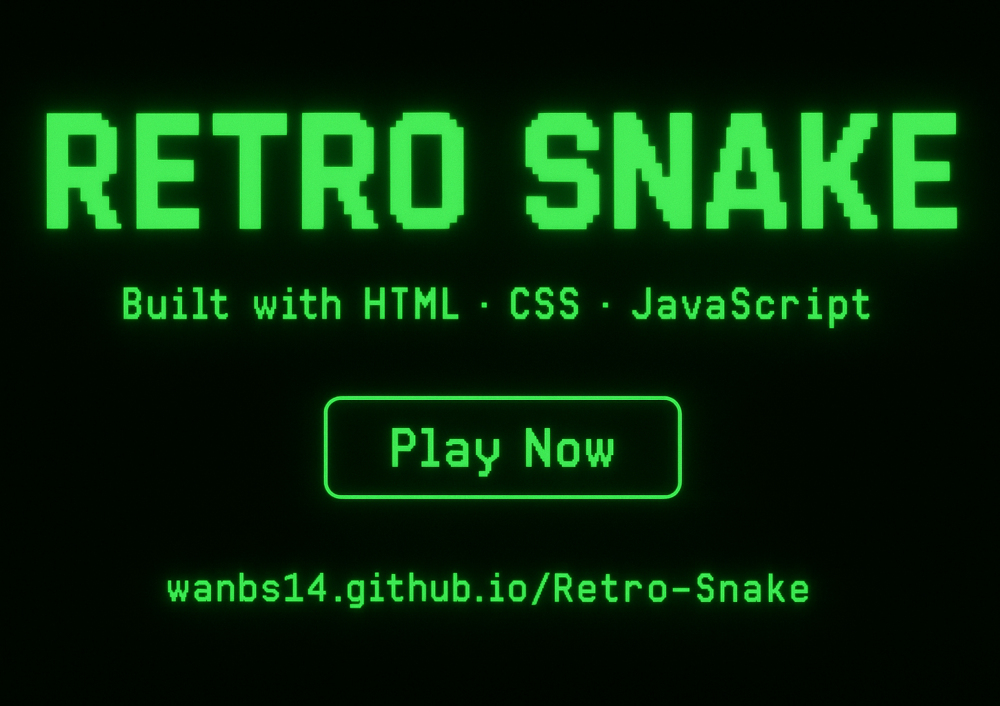

# 🐍 Retro Snake

**Retro Snake** est une petite réinterprétation du jeu du serpent, codée entièrement en **HTML**, **CSS** et **JavaScript**.  
L’objectif était simple : recréer ce classique intemporel avec une touche moderne, une interface propre et un style rétro inspiré des écrans d’arcade verts.  

Ce projet est léger, rapide à lancer et parfait pour apprendre ou montrer ses bases en JavaScript.

---

## 💬 À propos du projet

J’ai créé **Retro Snake** avant tout pour pratiquer les bases du **JavaScript pur**, sans frameworks ni bibliothèques.  
C’était aussi un moyen de travailler sur :
- La gestion du canvas et des animations  
- Le stockage local avec `localStorage`  
- L’organisation du code d’un petit projet de jeu  
- Et bien sûr… un peu de nostalgie 🕹️  

C’est un projet simple, mais j’y ai mis du soin, et c’est aussi un bon point de départ pour ajouter d’autres fonctionnalités.

---

## 🎮 Fonctionnalités

- Contrôle du serpent avec les flèches du clavier  
- Vitesse qui augmente au fur et à mesure  
- Score affiché en temps réel  
- Meilleur score sauvegardé automatiquement (même après fermeture du navigateur)  
- Écran de fin avec bouton **Rejouer**  
- Design vert néon façon terminal rétro  

---

## 💻 Technologies utilisées

- **HTML5** → structure du jeu et canvas  
- **CSS3** → design rétro et mise en forme  
- **JavaScript (ES6)** → logique du jeu, mouvements et collisions  
- **localStorage** → sauvegarde du meilleur score localement  

---

## 🚀 Jouer en ligne

🕹️ Essaye le jeu directement ici :  
👉 [https://wanbs14.github.io/Retro-Snake](https://wanbs14.github.io/Retro-Snake)

---

## ⚙️ Jouer en local

1. Clone le projet :
   ```bash
   git clone https://github.com/wanbs14/Retro-Snake.git
